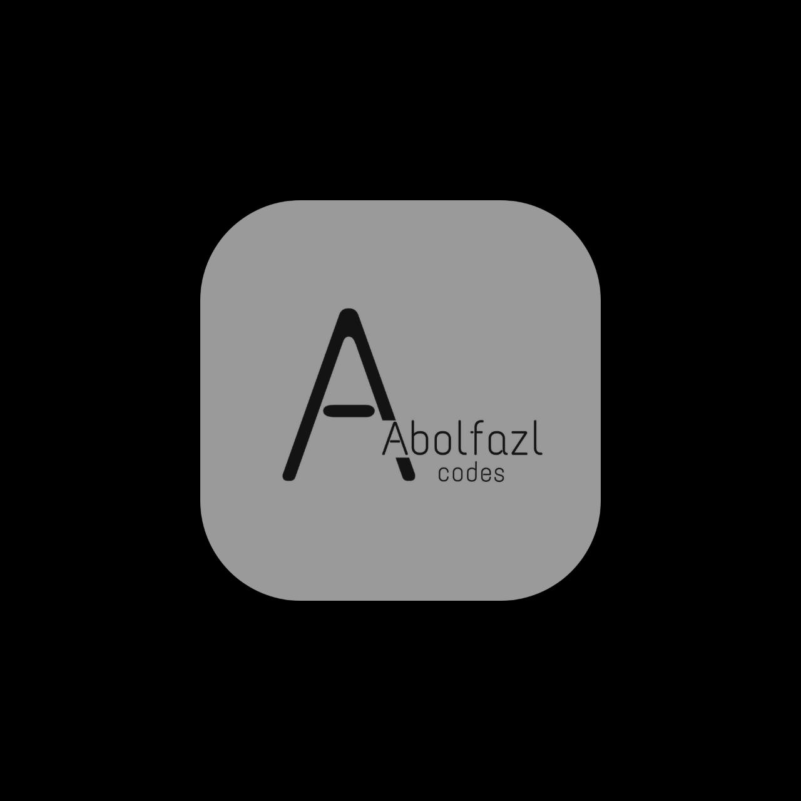

- Hello! I'm Abolfazl Babaei, a back-end developer with a deep passion for learning and growth. 🌱

- I thrive in collaborative environments and am always eager to contribute to team projects. My focus is on delivering the best possible results, and I'm constantly seeking new challenges that push me to expand my skills and knowledge. Let's build something amazing together! 🚀

---
# My Expertise
 
 
---
## Technologies that I know 
- HTML 5
- CSS 3
- Ajax
- JavaScript

